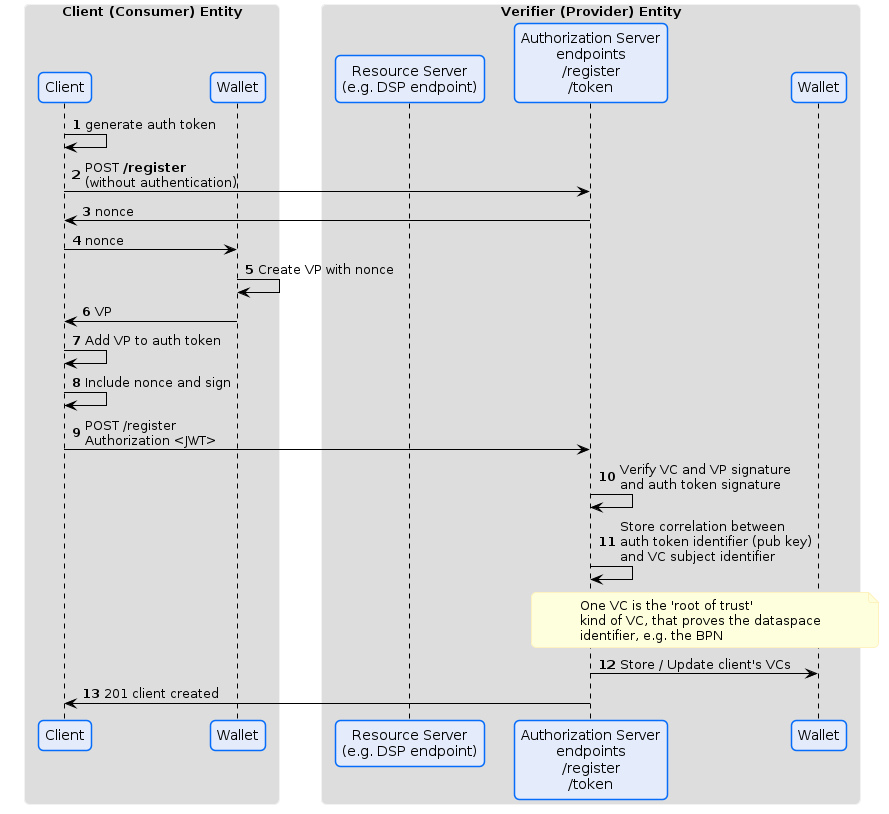
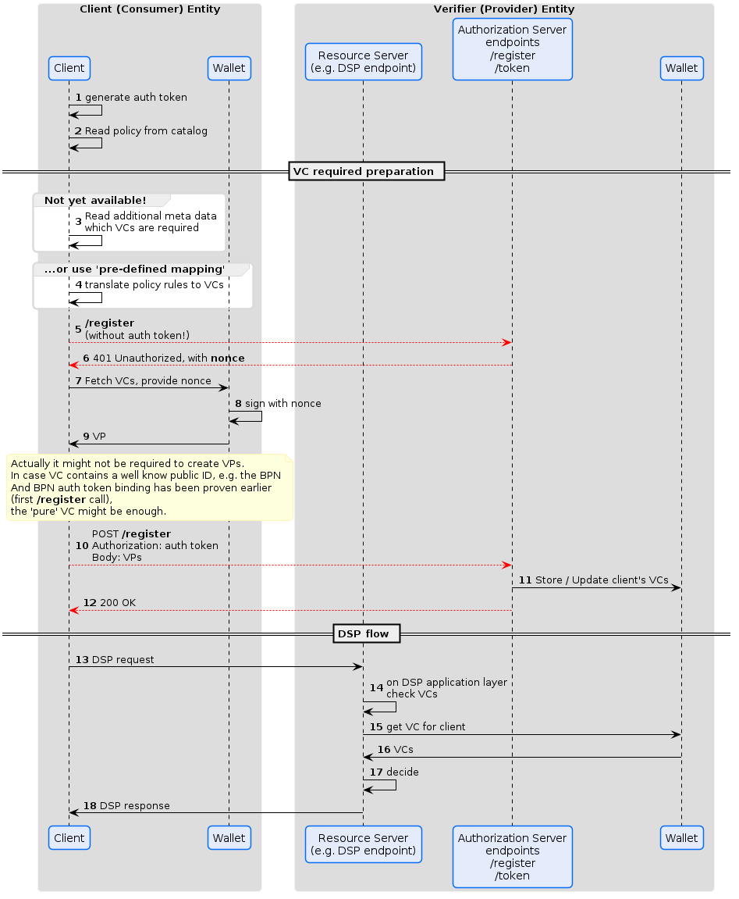

# DSP and SSI

Generally, SSI and VCs / VPs can be used to 'enrich naked identity' with VC based claims.

The often (often in technical systems communication) used 'client credentials' flow, does not use an */authorize* endpoint and thus, the general OID4VP flow (that is very human being centric) can not be applied directly.

With **client credentials** flow, the *authorization* is stored in the client's credentials it uses to authenticate itself at the authorization server.

Especially in a Dataspace, to manually register every client with every other dataspace partcipant's Authorization Server is unrealistic and against the gernal idea of the 'register once and communicate with all' dataspace idea.

A dynamic, automated registration, based on VCs, is a scalable solution that still allows the use of well known OAuth *client credentials* flow.

**OAuth 2.0 Dynamic Client Registration Protocol**
https://datatracker.ietf.org/doc/html/rfc7591#section-3

As of now, there is no such dyanmic client registration starnadized that makes use of VCs. The following sections will describe how this can be done:

## VC based dynamic client registration

The *auth token* is based on a local pubic / private key pair. It is also possible to use different (multiple) such key pairs, menaing a separate *connection key pair* if desired.

## Access Token
After the client is registered, a regular access token to access a resource at another's participant resource can be fetched.

## Considerations
Whenever a new client registers, even when it is already known via the public identifier (e.g. BPN), the authorization server MUST create a new connection and MUST not re-map existing VCs to the new connection identity. This allows the client to re-generate new connection identities and clearly knowing what authorization is loaded to this specific identity and gives the Client mor sovereignty about what authorization to use in what call.

## Verifier tasks during authorization at the /token endpoint

Generally the validity of the VC, which are the basis for authorization need to be checked before a new access token is issued.

This includes the expiration date and revication status of the VCs.

# Dataspace Protocol Integeration
Application layer protocol such as the Dataspace Protocol (DSP) can integrate the flow with the following consideration.

In DSP, the 3rd party attested claims (VCs) are supposed to be used beyond simple resrouce access control, e.g. as part of the DSP contract negotiation process.

If VCs are required to proof fullfilling certain DSP contract policies, there are a few steps required:

- DSP needs to define how Policies / Rules can express such required proofs
- DSP shoud provide a mechanism to transfer the required proofs
- DSP needs to define errors in case those proofs are not accepted

The transfer of the proofs (VCs) may be defined as out-of-band for the DSP protocol. This is not the desired approach, but could be seen as an intermediate solution step.

The general question is, how does the application layer protocol (DSP) know or map its requirements. In the fist step, this can be a dataspace specific pre-defined mapping of Policies into a VC requirments list. Generally, the protocol should provide a mechanism to transfer a specific list of such proof requirements.

The depicted flow uses the OAuth dynamic client registration endpoint to add additional authorizations (VCs) to the Client's identity. Once done, the DSP contract negotiation is started and the provider needs to check whether all required proofs are 'loaded onto the identity' in an out-of band step that queries the Wallet.
