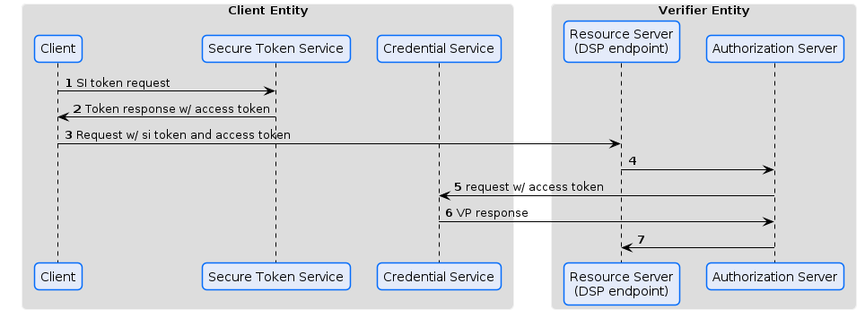
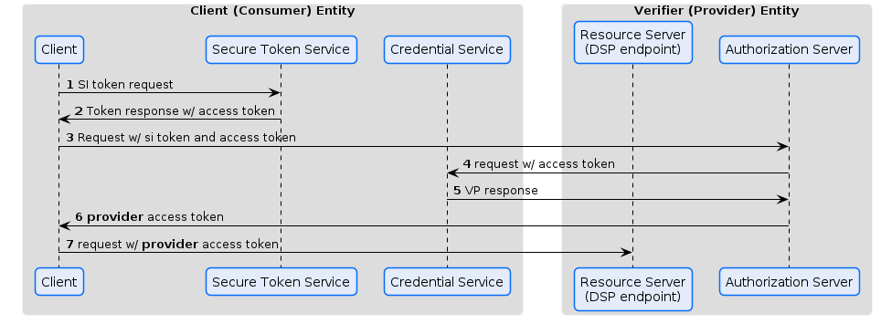
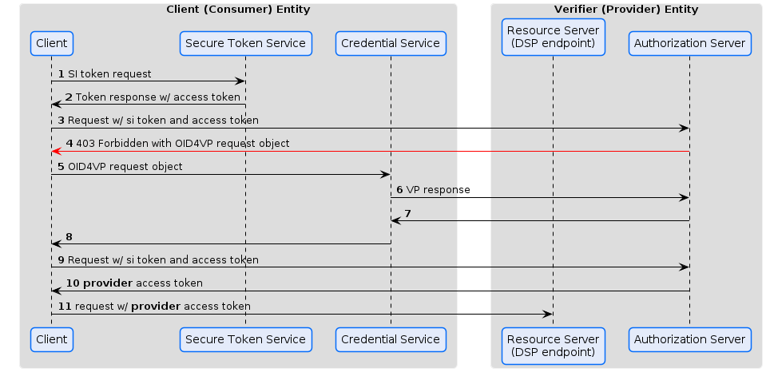

# Presentation Flow Discussion
### The flow right now

### Introduce logical 'Authorization Server'
Separate the Resource Server from the Authorization Server as it is done in OAuth 2.0. Maybe that was always part of the flow, but just not visible.

### More OAuth style to request an access token form the Auth Server first
Typical flow in *Client Credential* flow is to get an access token for the resource first.

Differentiates between **access token** and **provider access token**

The **provider access token** is completely under the control of the provider and allows sovreign decisions, e.g. token lifetime.

### Introduce OID4VP direct_post

The red colored part is not standardized in OID4VP!
The *Client Credentials* flow seems not to be in focus yet.

# Backlog
- VC Proofs in ODRL policies
- DSP 'application layer' and VC proofs, e.g. where should errors be handled

