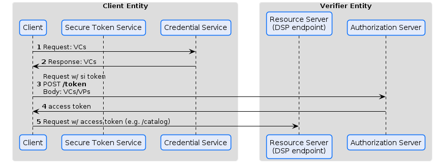
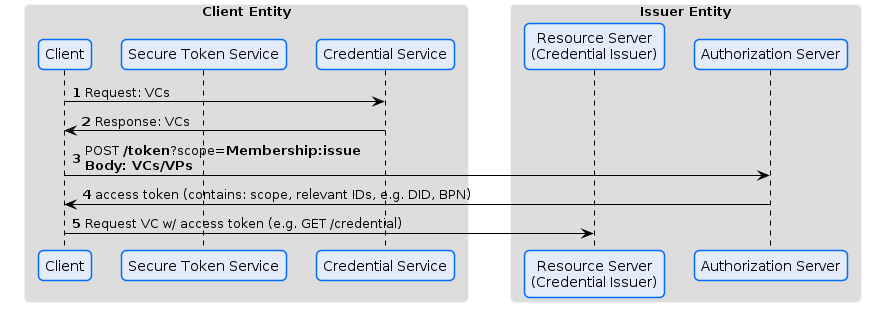

# Token Exchange

## Presentation
A very simple approach that supports 'pushing' VCs is as follows:

The client fetches the required VCs/VPs from its own Credential Service.
It posts it (Body) as part of a */token* request, containing the required scopes in its query params, to an authroization server.

*Nonces* are not yet part of the visualization, but should be considered.

Additionally, a binding of the access token should be considered.

## Issuing

