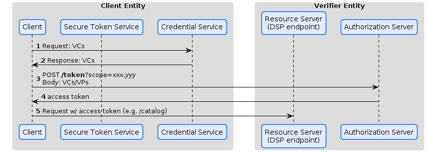

# Token Exchange

# Overview
## Presentation
A very simple approach that supports 'pushing' VCs is as follows:


The client fetches the required VCs/VPs from its own Credential Service.
It posts it (Body) as part of a */token* request, containing the required scopes in its query params, to an authroization server.

*Nonces* are not yet part of the visualization, but should be considered.

Additionally, a binding of the access token should be considered.

## Issuing


# Details
## General

This specification uses [RFC 7523 - JSON Web Token (JWT) Profile for OAuth 2.0 Client Authentication and Authorization Grants](https://datatracker.ietf.org/doc/html/rfc7523) with an optional [RFC 7591 - OAuth 2.0 Dynamic Client Registration Protocol](https://datatracker.ietf.org/doc/html/rfc7591)

Both, the `/token` and `/register` endpoints are extended by this specification to receive Verifiable Credentials and Presentations to be included for authorization.

The *Dynamic Client Registration* is optional, since all required credentials can be used during the token exchange. OAuth does not reuqire registered clients. Especially in cases when *Clients* do not have access to relevant credentials another entity, that has access to such higher trust credentials (e.g. a *legal PID* / a legal entity identifier credential), may pre-register a *Client*.


### Client Authentication
Client authentication is based on [JSON Web Token (JWT) Profile for OAuth 2.0 Client Authentication and Authorization Grants](https://datatracker.ietf.org/doc/html/rfc7523)

This authentication method name is defined in [OpenID Connect Core 1.0 incorporating errata set 1](https://openid.net/specs/openid-connect-core-1_0.html#ClientAuthentication)

The method used in this specification is: `private_key_jwt`

A separate `authorization request / grant` is not required when a client authentication covers the authorization, see [The OAuth 2.0 Authorization Framework, Client Credentials Grant, Authorization Request and Response](https://www.rfc-editor.org/rfc/rfc6749.html#section-4.4.1)

The OAuth Framework generally also allows unregistered clients! [The OAuth 2.0 Authorization Framework, Unregistered Clients](https://www.rfc-editor.org/rfc/rfc6749.html#section-2.4)

### private_key_jwt
Structure accroding to [JSON Web Token (JWT) Profile for OAuth 2.0 Client Authentication and Authorization Grants](https://datatracker.ietf.org/doc/html/rfc7523) and [OpenID Connect Core 1.0 incorporating errata set 1
, Client Authentication](https://openid.net/specs/openid-connect-core-1_0.html#ClientAuthentication):

- `iss`: REQUIRED. Issuer. This MUST contain the `client_id` of the OAuth Client.
- `sub`: REQUIRED. Subject. This MUST contain the `client_id` of the OAuth Client.
- `aud`: REQUIRED. Audience. The `aud` (audience) Claim. Value that identifies the Authorization Server as an intended audience. The Authorization Server MUST verify that it is an intended audience for the token. The Audience SHOULD be the URL of the Authorization Server's Token Endpoint.
- `jti`: REQUIRED. JWT ID. A unique identifier for the token, which can be used to prevent reuse of the token. These tokens MUST only be used once, unless conditions for reuse were negotiated between the parties; any such negotiation is beyond the scope of this specification.
- `exp`: REQUIRED. Expiration time on or after which the ID Token MUST NOT be accepted for processing.
- `iat`: OPTIONAL. Time at which the JWT was issued.

### private_key_jwt extension with `sub_jwk`
This specification further specifies the `sub_jwk` claim, also described in [Self-Issued ID Token, Self-Issued OpenID Provider v2](https://openid.github.io/SIOPv2/openid-connect-self-issued-v2-wg-draft.html#section-11)

With the `sub_jwk` thumbprint used as the identifier in `kid`, `iss` and `sub`, it is prefixed as described in [RFC 9278 - JWK Thumbprint URI](https://datatracker.ietf.org/doc/html/rfc9278) with e.g. `urn:ietf:params:oauth:jwk-thumbprint:sha-256:` depending on the used hasing algorithm. This specification assumes SHA256.

Alternatively, a DID (Decentralized Identifier) with scheme `did` can be used. Consequentely, the signing key needs to be resolvable via the respective DID document.

> TODO: meta information to define what signing methods are allowed

### private_key_jwt extension with `vc` and `vp`
The afore described `private_key_jwt` token structure is exted by this specification with the following attributes:
> TODO: https://openid.net/specs/openid-4-verifiable-credential-issuance-1_0.html#section-e.1 and https://www.w3.org/TR/vc-data-model/#json-web-token-extensions

- `vp`:
- `vc`:

### `VP` vs `VC`
Signatures / proofs are required for the `private_key_jwt` (the authentication token) and the proof that confirms the `participant_id` and `did`

The additional claims don't necessarily need to be part of a `VP`, but via their `credentialSubject.@id` are bound to their `did` (potentially also to their `participant_id`)

Only if the claims are required to be bound to a specific transaction, a `VP` with a challenge response (`nonce` / `challenge`) needs to be used. In most cases in Dataspace connections, this is not the case.

### Interoperability Agreements

[Interoperability Considerations](https://datatracker.ietf.org/doc/html/rfc7523#section-5)

- identifiers: `did:web` according to [did:web Method Specification](https://w3c-ccg.github.io/did-method-web/)
- keys: unique key identifier fetched from DID documents
- endpoints: the **/token** endpoint at the authorization server is added to the DID document `service` list with the type `AuthorizationServerTokenEndpoint`

### Client Authentication /token
Client authentication is specified in
[JSON Web Token (JWT) Profile for OAuth 2.0 Client Authentication and Authorization Grants, Using JWTs for Client Authentication](https://datatracker.ietf.org/doc/html/rfc7523#section-2.2)

#### Request
> Non-normative example:
The value of the "client_assertion_type" is "urn:ietf:params:oauth:client-assertion-type:jwt-bearer"

```
POST /token HTTP/1.1
Host: as.example.com
Content-Type: application/x-www-form-urlencoded

client_assertion_type=urn%3Aietf%3Aparams%3Aoauth%3A
client-assertion-type%3Ajwt-bearer&
client_assertion=eyJhbGciOiJSUzI1NiIsImtpZCI6IjIyIn0...
```

#### Response

#### Error

## Presentation

## Issuance
